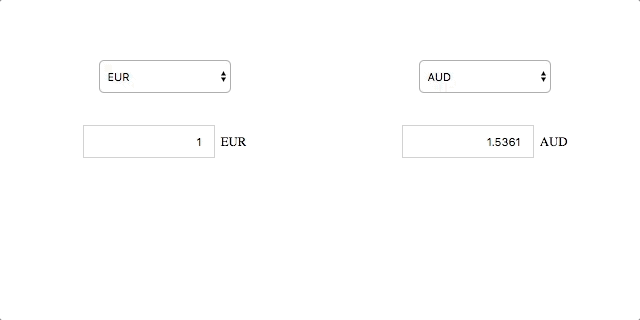

# Challenge Facultatif

React + Fixer.io + Chart.js = <3

## Instructions

* Au chargement de page, on doit effectuer des requêtes vers http://fixer.io
pour récupérer les taux de change des 30 derniers jours.

* Utiliser Chart.js pour créer un graphique représentant ces taux de change.




## Whaaaaat ?!

Pas de panique :

* La création du graphique est géré par la librairie

* Les animations et le fait de pouvoir sélectionner les devises à afficher est gérée par la librairie

* La difficulté réside en fait dans l'utilisation de l'API fixer.io, dans l'organisation
de code, et dans la structuration des données pour les donner correctement à Chart.js

* Un peu d'aide :

```js
import { Line } from 'react-chartjs-2';

/* ... */

// Dans render()
// labels = ['2017-03-29', '2017-03-30', ...]
// datasets = [
//   {
//     label: 'USD',
//     data: [
//       1.0712,
//       1.0698,
//       ...
//     ],
//     borderColor: '#c50',
//     pointBackgroundColor: '#fff',
//     fill: false,
//     lineTension: 0.2,
//   },
//   ...
// ]
<Line data={{ labels, datasets }} />
```

## Liens

* https://github.com/gor181/react-chartjs-2
* http://www.chartjs.org/docs/#line-chart-introduction
* http://fixer.io/
* https://github.com/mzabriskie/axios
* https://developer.mozilla.org/fr/docs/Web/JavaScript/Reference/Objets_globaux/Promise
* https://developer.mozilla.org/fr/docs/Web/JavaScript/Reference/Objets_globaux/Promise/all
